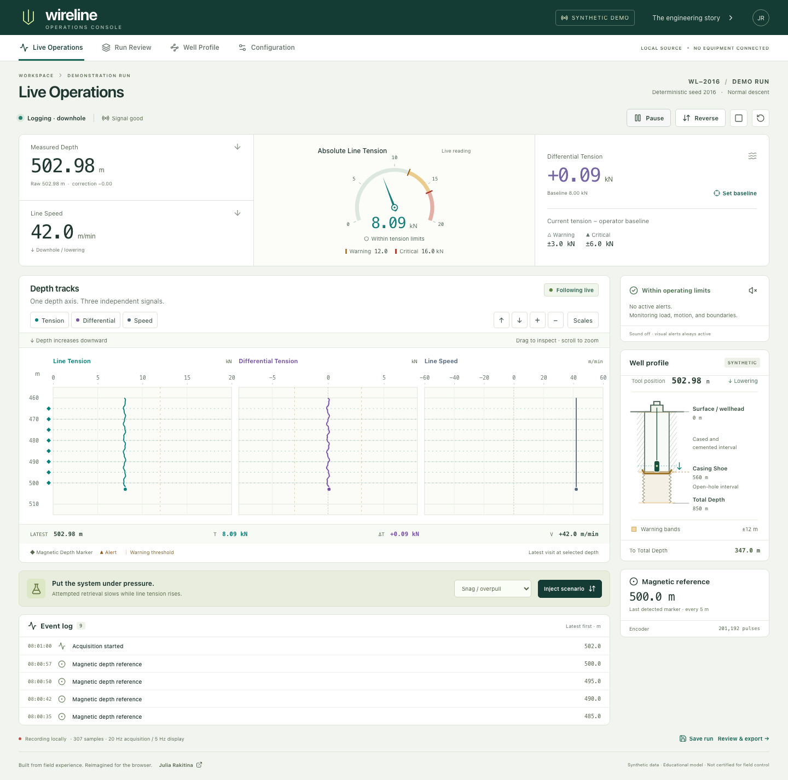
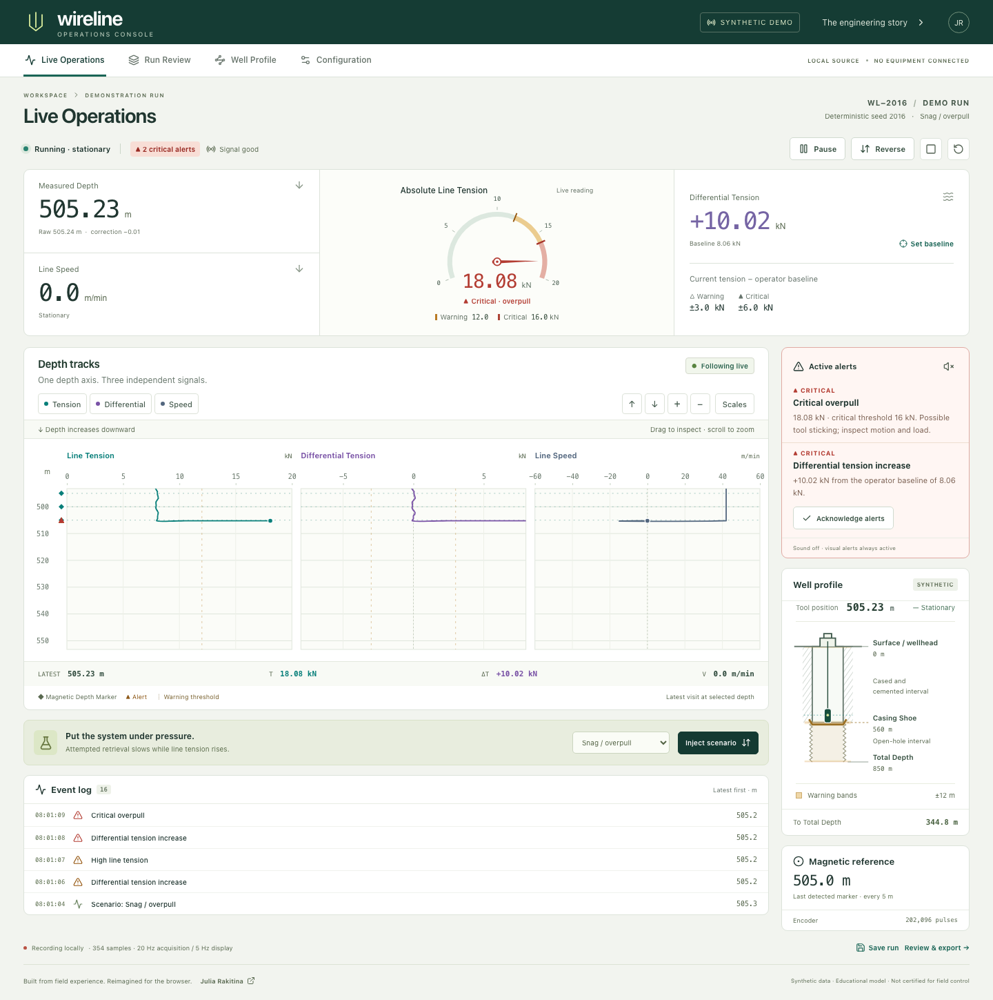
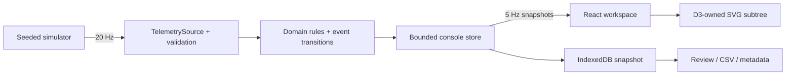

# Wireline Operations Console

**A real-time wireline monitoring workspace where cable depth, load, and measurement confidence stay connected.**

React · strict TypeScript · D3 · deterministic telemetry · tested operator workflows

> **Live demo — awaiting Julia's publication approval.** Nothing is deployed. Run locally with `pnpm dev` after installing dependencies.



## Try it in 60 seconds

1. **Start run.** Watch measured depth advance downward. Hover across all three tracks; drag or zoom into history. New samples keep arriving without moving your inspected window. Click **Back to Live**.
2. **Set baseline**, then choose **Snag / overpull** in the scenario lab below the chart and **Inject scenario**. Upward motion stops while absolute and differential tension rise. Warning precedes critical. Acknowledge the alert; its physical condition stays visible.
3. Inject **Encoder degradation**. Raw depth undercounts cable travel. A magnetic marker establishes a visible correction while acquisition remains explicitly degraded.
4. Open **Run Review** to scrub, replay at 1–8×, or export CSV and the run metadata. Open **Well Profile** for construction geometry and the clearly labeled survey prototype.

**Reset** returns to seed 2016, default settings, and a 60-second synthetic pre-roll. The demo opens ready to acquire, with enough history to inspect immediately. Pause freezes acquisition; inspecting history does not.

| Scenario            | What to look for                                                                             |
| ------------------- | -------------------------------------------------------------------------------------------- |
| Normal descent      | Smooth lowering, small load variation, regular magnetic references                           |
| Pause and reverse   | Deceleration, a stationary interval, then a second chronological pass through depth          |
| Snag / overpull     | Speed falls while tension rises; warning → critical; horizontal load excursions at one depth |
| Sudden tension loss | Critical loss-of-load alert with possible causes, without asserting a diagnosis              |
| Encoder degradation | Missed pulses, uncertain depth, logged magnetic correction; quality remains degraded         |
| Boundary approach   | Explicit synthetic reposition near Total Depth, followed by configurable proximity alerts    |

## The industrial problem

A downhole instrument moves through a borehole on a cable. A wireline operator needs to know where it is, how fast it is moving, how much load the cable carries, and whether those measurements remain trustworthy. Legacy wireline logging winch units often conveyed this through mechanical gauges.

**Depth grows downward because the tool does.** Tension, differential tension, and speed use different horizontal scales but share the same vertical measured-depth axis. Reversing the cable revisits depths; a snag can change tension without changing depth. Shared depth tracks keep those relationships visible alongside instantaneous instrument readings.

Read Julia's account: [The chart that had to grow downward](https://dev.to/julia_rakitina/the-chart-that-had-to-grow-downward-20h3).

## From sensor to operator screen

Modern clean-room reimplementation of a wireline acquisition and monitoring system originally designed, implemented, and field-tested by **Julia Rakitina in 2015–2016**. The foundational architecture later evolved to LabJack-based acquisition and modern tablet software and was commercialized in 2026.

Julia's foundational work covered sensor and acquisition hardware selection, encoder-derived depth and speed, tension measurement, magnetic markers, correction, safety alerts, calibration/settings, recording, review, visualization, and operator-interface localization. The original Arduino acquisition layer missed encoder pulses at high input rates in field tests. That exposed an acquisition bottleneck; the later hardware changed while the operating principles endured.

The original operator interface combined a large, configurable line-tension needle gauge with depth-indexed tracks and English, Russian, and Azerbaijani localization, including a saved language preference. The new portfolio interface is English and combines a central tension gauge with depth tracks; the [legacy behavior map](docs/legacy-behavior-map.md) documents these historical capabilities.

This account credits the original system and architecture. It does **not** attribute every subsequent production rewrite to Julia. The present simulator is not connected to operating equipment. Historical inclinometry work was a visualization/planning prototype; physical instrument integration did not reach the field-complete state of the core depth/tension system.

## What is implemented

- **Depth tracks:** focused D3 scales, axes, chronological paths, per-track clipping, depth-only zoom/pan, synchronized crosshair, keyboard inspection, track toggles, editable X domains, and explicit live/history ownership.
- **Physical model:** pulse calibration, signed line speed, raw/corrected depth, magnetic reference corrections, direction and acquisition quality. Every run is deterministic for its seed and command sequence.
- **Operator baseline:** `differential tension = current line tension − operator baseline`. It retains the sign. Setting a baseline logs an event; separate warning/critical limits apply to its magnitude.
- **Line-tension instrument:** a central needle gauge shows absolute load, its exact value, and configured warning/critical zones. Its scale stays fixed during acquisition. Explicit loss-of-load, out-of-range, paused, and stale-reading labels prevent a low or frozen needle from implying normal live operation.
- **Alerts:** explainable load, loss-of-load, differential, and directional boundary rules. Acknowledgment belongs to the current occurrence and expires when it clears. Sound is opt-in.
- **Geometry:** surface, cased and cemented interval, Casing Shoe, open hole, Total Depth, tool position and warning bands derive from one configuration.
- **Review:** bounded recording, IndexedDB persistence, replay speeds, time/depth scrubbing, event selection, CSV, and JSON with initial settings plus timestamped configuration revisions. Historical annotations use the settings effective at the selected sample.
- **Prototype survey:** synthetic inclination and azimuth versus measured depth, synchronized stations and a derived 2D vertical section distinguishing MD from TVD.
- **Failure behavior:** malformed/duplicate/out-of-order sample rejection, timestamp-gap discontinuities, stale delivery, restart, storage failure, and explicit encoder degradation.



## Architecture



| Module          | Owns                                                                             |
| --------------- | -------------------------------------------------------------------------------- |
| `domain`        | Canonical metres, seconds and kN; configuration; derived calculations; lifecycle |
| `telemetry`     | Source interface, seeded simulator, validation and bounded buffers               |
| `alerts`        | Pure explainable rules                                                           |
| `recording`     | Versioned snapshots, configuration revisions, persistence, exports               |
| `visualization` | Depth geometry, viewport ownership, D3 rendering, well and survey views          |
| `features`      | Operator commands, external-store publication, live/review/settings screens      |

### Engineering decisions

- **Acquisition and rendering have different clocks.** All 20 Hz samples drive alert evaluation; React receives 5 Hz snapshots. Marker, discontinuity and worst-quality flags survive the display boundary. Event transitions are collected at acquisition rate.
- **The viewport is operator-owned state.** Live-follow derives a window from the newest sample; inspection stores a fixed domain. Arrival changes data, never that domain. Returning live is explicit.
- **React and D3 have separate DOM ownership.** React composes controls and the SVG scaffold. D3 owns one drawing subtree and its zoom behavior. No competing updates to the same nodes.
- **Quality is orthogonal to lifecycle.** Running with degraded encoder data is a meaningful state. Correcting position does not magically repair acquisition.
- **A bounded local product is enough.** No ceremonial database or server. `TelemetrySource` leaves a clear seam for a future adapter; transport/reconnect and real equipment commands would need their own implementation and review.
- **Current, compatible tooling.** React 19.3 / Vite 8.3 / Vitest 5; TypeScript 6.0 is deliberately used because the current TypeScript ESLint parser supports it. Exact resolutions are in the lockfile.

## Run locally

Prerequisites: Node.js **22.12+** (Node 24 tested), pnpm **10.28.2**.

```sh
pnpm install --frozen-lockfile
pnpm dev
```

Open [localhost:5173](http://localhost:5173). No environment file, credentials, account, or external service is required. The dev server binds to loopback. Build output uses relative asset URLs for a future approved static deployment.

## Verify

```sh
pnpm typecheck
pnpm lint
pnpm format:check
pnpm test
pnpm build
pnpm exec playwright install chromium
pnpm test:e2e
pnpm scan:safety
```

CI runs the same checks, including browser tests. It contains **no deployment job**. E2E tests cover the recruiter path, viewport retention during acquisition, real wheel/drag behavior, configuration propagation, degraded acquisition, saved-run reload, exports, desktop/tablet/mobile layout, and automated WCAG AA checks on the four primary screens. Tests generate the real screenshots in `docs/screenshots`.

For the repeatable 60-second browser measurement, start `pnpm dev` in one terminal and run:

```sh
node scripts/benchmark-browser.mjs
```

See [performance and visual QA](docs/performance.md) for measured results and their limits.

## Data, provenance, and limits

**Every measurement and survey station is synthetic.** Supplied archives were inspected read-only for behavior; no legacy source, real LAS file, database, credentials, customer details, or production configuration is shipped. The safety scan emits categories/counts, never sensitive matching text. Automated pattern checks complement manual source/screenshot review; they cannot prove the absence of every possible secret or real name.

This is an **educational portfolio model, not certified field-control software**. Its physics, marker correction and thresholds are intentionally transparent simplifications. It must not control a logging unit or guide real operational safety decisions.

- Retains up to **12,000 display samples** (about 40 minutes at 5 Hz), **500 events**, **64 settings revisions**, and one latest browser snapshot. It is not a lossless 20 Hz or unlimited historian. Very frequent settings edits shorten retained history so surviving samples retain complete settings provenance.
- Browser scheduling may slow simulation time; delivery stalls are labeled. A marker corrects a reference but does not restore encoder quality.
- Survey geometry is synthetic and uses a simple balanced-tangential method, not a survey-grade interpretation package.
- **LAS export is intentionally omitted.** Repeated depths, stationary load changes, reversals and reference discontinuities require explicit pass selection and resampling before a meaningful depth-indexed LAS 2.0 export. CSV retains the chronology; JSON retains metadata. No misleading LAS file is produced.
- Chromium is the verified browser. Real hardware/transport, multi-user operation, external deployment, and formal accessibility/safety certification are outside this build.
- No open-source license has been added. Publication and licensing require Julia's approval.

## Further reading

[Architecture](docs/architecture.md) · [Domain model](docs/domain-model.md) · [Field scenarios](docs/field-scenarios.md) · [Legacy behavior map](docs/legacy-behavior-map.md) · [Provenance and safety](docs/provenance-and-safety.md) · [Design](DESIGN.md) · [Interview guide](docs/interview-guide.md)
