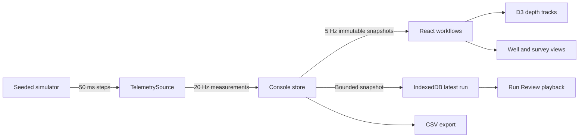

# Architecture

The console is a local browser application: React composes operator workflows, TypeScript domain modules describe measurements and state, and focused D3 modules implement the depth visualization. It requires no account, server, runtime API key, external font, or connection to equipment.

## Data ownership

The sample is the shared contract. It contains timestamp, sequence, encoder count, raw and corrected depth, correction offset, direction, speed, absolute tension, baseline, signed differential tension, marker state, acquisition quality, active alerts, and a discontinuity flag. Charts, events, review, and export consume that contract rather than asking a sensor how to draw itself.

| Boundary            | Responsibility                                                                                                 |
| ------------------- | -------------------------------------------------------------------------------------------------------------- |
| `src/domain`        | Types, unit conventions, calibration and derived calculations, configuration validation, lifecycle transitions |
| `src/telemetry`     | Source contract implementation, deterministic simulation, quality and sample validation, bounded buffering     |
| `src/alerts`        | Explainable warning/critical rules and transitions                                                             |
| `src/features`      | Operator commands, external store, navigation and screen composition                                           |
| `src/recording`     | Bounded run snapshots, IndexedDB persistence, depth lookup, CSV                                                |
| `src/visualization` | Shared depth geometry, independent measurement scales, clipping, inspection, well and prototype survey views   |

`TelemetrySource` exposes `subscribe`, `start`, `pause`, and `dispose`. A future WebSocket adapter can provide measurements at this seam without changing chart geometry or domain units. Simulator-specific commands such as scenario injection remain in the application store. A real adapter would need a separate command/acknowledgment contract, transport validation, authentication, and a reviewed safety boundary; this demo does not claim those integrations exist.

## Acquisition and rendering

The simulator advances in fixed 0.05-second steps at a nominal 20 Hz. The store publishes an immutable sample/history snapshot every fourth acquisition, at 5 Hz. React subscribes to the store rather than receiving a state update for every sensor tick. Event collection continues at acquisition rate, so a transition can be recorded between visible frames.

The displayed and recorded measurement window retains at most **12,000 samples**. At 5 Hz, that is approximately **40 minutes of simulation time**. The event window retains at most **500 events**. Once a limit is reached, the oldest entries leave the retained window. This is a bounded demonstrator, not an unlimited historian or a lossless 20 Hz recorder.

Browser timer delays do not synthesize a backlog of measurements that were never acquired. Simulation time follows completed fixed steps; it can run more slowly than wall time in a throttled background tab. Performance measurements and actual tested duration belong in [performance.md](performance.md).

## State is not one collection of booleans

Three independent concerns have separate owners:

1. **Acquisition lifecycle:** ready, connecting, running, paused, stopped, or faulted; moving states carry a requested direction.
2. **Measurement quality:** good, degraded, or stale. A running source can have degraded quality without becoming a different kind of lifecycle.
3. **Presentation:** live-follow, historical inspection, or review playback. Inspecting history does not pause acquisition; replay does not rewrite live samples.

Alert acknowledgment is also independent of the physical condition. Acknowledging confirms the operator has seen an alert; it does not make tension normal or remove an active boundary condition. An acknowledgment applies only to an uninterrupted occurrence at that severity; clearing and recurring or changing severity requires renewed attention. Sound is an explicit presentation preference with an equivalent visual alert.

## React and D3 ownership

React owns component composition, settings, buttons, status text, and accessible controls. The depth-chart integration owns its D3 drawing subtree and event behavior. D3 supplies scales, axes, lines, zoom, selection, and geometry through focused packages, rather than an undifferentiated chart dependency.

Depth maps to increasing Y. Each enabled track owns its X scale and clip rectangle. Depth pan/zoom is separate from X-domain editing. The inspected depth window is user state: a new sample updates data without replacing that window. **Back to Live** explicitly restores follow behavior. Chronological samples remain distinct when the tool revisits a depth, and correction discontinuities must not be presented as continuous physical motion.

The live window leads in the current movement direction. History mode reports elapsed simulation time since the last viewport interaction and, when the latest depth is outside the window, its distance from that window. The synchronized readout selects the most recent continuous crossing of the requested depth and the nearer observed endpoint; equal distances favor the newer observation. If no crossing exists, it uses the nearest retained observation. Explicit pan/zoom buttons and keyboard controls provide alternatives to dragging and wheel interaction.

## Recording and replay

IndexedDB stores one bounded **latest run** snapshot. Autosave occurs at approximately 15 seconds of advancing simulation time; pause, stop, and explicit save also preserve the current window. This limits retained browser data and keeps evaluation simple. It is not a multi-run asset-management system.

A saved run contains a schema version, synthetic identity/seed, configuration at save time, timestamped configuration revisions beginning with the initial settings, retained samples and events, and save timestamp. Review resolves the configuration effective at the selected sample's timestamp, so historical boundary and threshold annotations match that sample's settings. Revisions take effect after the last already-recorded sample; applying settings never reinterprets earlier measurements.

Configuration history retains at most **64 revisions**. Repeated edits at the same acquisition timestamp coalesce. When that limit is exceeded, samples older than the earliest retained revision also expire, preserving settings provenance for every remaining sample. Configuration events remain useful operator history, but neither they nor the retained revision window are an indefinite audit trail. Review operates on a snapshot so live updates do not move its scrubber. CSV preserves chronological sample visits and canonical units.

Review supports 1×, 2×, 4×, and 8× playback, time-index scrubbing, depth seeking, and event selection. Hover inspects the crosshair without interrupting playback; an explicit chart click selects a depth within the already displayed chronology. The depth-seek field can search the whole retained run. A JSON **Run + metadata** download preserves configuration revisions/events alongside samples; CSV is the tabular measurement export.

Storage failure leaves in-memory review and CSV export available. Browser storage is local to the browser/origin and may be cleared by the user or browser. Export is the portable copy.

## Deliberate tradeoffs

- **External store instead of a large state framework:** one telemetry owner, explicit commands, a stable snapshot contract, and a clear publication rate are sufficient for this scope.
- **SVG instead of a WebGL renderer:** a bounded number of track paths provides inspectable geometry, ordinary browser tooling, and straightforward clipping. A much larger channel count would justify profiling canvas/WebGL.
- **Fixed-step synthetic source instead of a ceremonial backend:** determinism, local startup, and meaningful physical scenarios matter more than adding a service solely to claim a distributed stack.
- **5 Hz retained samples instead of raw acquisition storage:** readable interaction and bounded browser memory are prioritized. Every raw 20 Hz sample is not preserved.
- **Explicit quality instead of false confidence:** raw and corrected depths remain visible; marker corrections and degraded acquisition are explained rather than silently normalized.
- **Simple survey geometry instead of a 3D scene:** the prototype communicates depth, inclination, and azimuth without suggesting hardware integration or a survey-grade trajectory algorithm.

## Verification boundaries

Domain tests target conversion, signed deltas, thresholds, transitions, correction discontinuities, scenarios, validation, and bounded retention. Component and browser tests target settings propagation and the operator path, especially preserving an inspected viewport during live arrival. Screenshot QA evaluates desktop, landscape tablet, and narrow-screen behavior. See the README and [performance.md](performance.md) for commands and measured results; this architecture document does not substitute design intent for test evidence.
