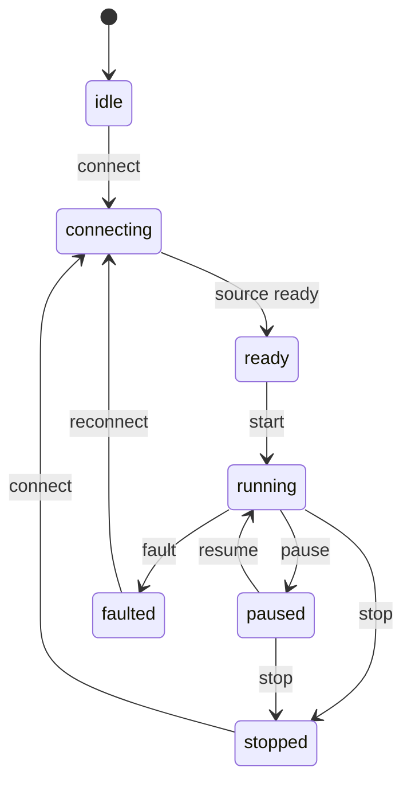

# Domain model

## The physical system

A **Wireline Logging Winch Unit** lowers and retrieves a downhole tool on a cable. The operator monitors cable travel and load at the surface. Measured Depth is the cable-derived depth estimate used by this simulator; it is not automatically true vertical depth or an independently surveyed tool position.

The schematic distinguishes surface/wellhead, the **Cased and Cemented Interval**, the **Casing Shoe**, the **Open-Hole Interval**, and **Total Depth (TD)**. The current tool position is derived from the same corrected depth used by the tracks and alerts.

## Canonical units

Domain calculations use metres, elapsed seconds, and kilonewtons. UI conversion does not change recorded values or safety-rule inputs.

| Quantity                 | Stored representation       | Interpretation                                                                        |
| ------------------------ | --------------------------- | ------------------------------------------------------------------------------------- |
| Timestamp                | UTC epoch milliseconds      | Transport/record identity; differences convert to seconds for physical rates          |
| Sequence                 | Nonnegative integer         | Observation ordering within a source epoch                                            |
| Encoder pulses           | Signed integer count        | Cable travel observed by the encoder                                                  |
| Raw depth                | m                           | Calibrated travel before reference adjustment                                         |
| Correction               | m                           | Explicit additive reference offset                                                    |
| Corrected Measured Depth | m                           | Raw depth plus correction                                                             |
| Line speed               | m/s, signed                 | Positive downhole, negative uphole                                                    |
| Line tension             | kN                          | Absolute measured load                                                                |
| Differential baseline    | kN                          | Operator-selected reference load                                                      |
| Differential tension     | kN, signed                  | Current absolute tension minus baseline                                               |
| Marker                   | Boolean                     | A reference crossing on this acquisition sample                                       |
| Quality                  | `good`, `degraded`, `stale` | Confidence in the acquisition stream                                                  |
| Discontinuity            | Boolean                     | Break in the depth history that should not be joined into a continuous physical trace |

The UI can display depth in metres or feet and speed in the corresponding length unit per minute. Exports remain in canonical units with explicit column names. Direction is also written as text rather than inferred only from a sign or color.

## Encoder depth and speed

For pulse count `p` and positive calibration `c` in pulses per metre:

```text
rawDepth = p / c
lineSpeed = (rawDepthNow - rawDepthPrevious) / elapsedSeconds
```

The calibration must be finite and positive; elapsed time must be finite and greater than zero. A corrected-depth jump does not enter the speed formula. In a missed-pulse scenario, raw encoder travel and derived speed can be underestimated; the quality flag makes that limitation visible rather than presenting a corrected number as proof that acquisition is healthy.

## Magnetic depth references

For a known synthetic marker reference `r`:

```text
correction = r - rawDepth
correctedDepth = rawDepth + correction
```

The raw count is retained. Updating the reference offset is logged as a marker event. A correction change greater than 0.05 m is flagged as a discontinuity, so the depth chart can break the path rather than draw an apparent physical jump.

This is a transparent educational model: marker locations are known to the simulator. It does not infer an unknown field marker identity, reconstruct missing pulses, estimate cable stretch, or implement a proprietary depth-correction algorithm. A reference can improve the depth estimate at a point while acquisition quality remains degraded.

## Absolute tension instrument

The central needle gauge displays absolute line tension in kN. Its range starts at zero and takes its upper bound from the configured critical limit with display headroom and rounded ticks (20 kN at default settings). Arrival of a new sample never changes the scale. Over-range readings clamp only the needle; the numeric reading and explicit range label remain visible. Warning/critical zones use the same settings and rules as alerts. A sudden tension loss is critical even at a low needle angle. Paused or stale values are labeled as last readings; encoder-only degradation does not imply a failed tension sensor.

## Differential tension

**Set Baseline** stores the current absolute tension. Every subsequent sample uses:

```text
differentialTension = currentAbsoluteTension - operatorBaseline
```

For example, a baseline of 8.0 kN and current load of 10.5 kN gives **+2.5 kN**; a load of 6.0 kN gives **−2.0 kN**. The baseline is not a second sensor, rolling average, automatic zero, or derivative. A fresh deterministic run initializes it to 8 kN; thereafter **Set Baseline** changes it explicitly. Scenario changes preserve it.

Severity uses the magnitude of the signed change. The UI keeps the sign and explains whether the load increased or decreased. Warning and critical thresholds are independently configurable; the critical threshold must exceed the positive warning threshold. Baseline changes are operator events, so review can explain why the displayed delta changed.

## Alert rules

Defaults are illustrative and have no field-operating authority.

| Condition                      | Default warning | Default critical | Rule                                                                      |
| ------------------------------ | --------------: | ---------------: | ------------------------------------------------------------------------- |
| Absolute line tension          |           12 kN |            16 kN | `tension >= threshold`                                                    |
| Differential tension magnitude |            3 kN |             6 kN | `abs(tension - baseline) >= threshold`; preserve sign in explanation      |
| Boundary approach              |            12 m |              3 m | Remaining distance at or inside the applicable band                       |
| Sudden tension loss            |               — | 4 kN/s fall rate | Compare consecutive absolute tensions over elapsed time                   |
| Synthetic low-load hold        |               — |    2 kN or below | Maintains critical loss-of-load visibility after the initial falling edge |
| Degraded or stale acquisition  |         Warning |                — | Explain uncertain or out-of-date depth                                    |

Threshold equality belongs to the more severe state. Critical is evaluated before warning. Multiple physically distinct alerts can be active together; the display sorts critical conditions first. Rules are deterministic functions of sample, configuration, and where needed the preceding sample. They do not diagnose a snag, dropped tool, or line break from one signal alone.

The 2 kN low-load floor is deliberately fixed and simulator-only. It is not a configurable equipment limit or evidence of a safe minimum load. No hysteresis or certified safety interlock is implied by these demo rules.

### Directional boundaries

- **Surface:** relevant during upward motion or while stationary near the surface.
- **Total Depth:** relevant during downward motion or while stationary near TD. At/beyond TD the remaining distance is zero.
- **Casing Shoe:** relevant while approaching it from above during descent or from below during retrieval. Once moving away, the approach alert clears; a stationary tool inside the band remains a proximity condition.

The default well has a 560 m Casing Shoe and 850 m Total Depth. Geometry validation requires `0 < casingShoe < totalDepth`, a positive critical distance smaller than warning distance, and a warning distance smaller than half the total well depth. One applied configuration updates the schematic, chart references, and rule engine.

Changing encoder calibration during a run rebases the count reference to preserve current corrected depth; subsequent travel uses the new calibration. Lowering TD below the current synthetic tool position explicitly repositions the tool to TD and logs a discontinuity. Neither operation is presented as actual cable travel.

Acknowledgment records that the operator saw current alert severities; it does not alter physical inputs or force an alert to clear. It expires when that condition clears or changes severity, so a recurrence requires fresh attention. Muting/sound preferences affect presentation only. Recovery occurs when the underlying rule is no longer true, and transitions appear in the event history.

## Lifecycle, quality, and review

The domain lifecycle uses a discriminated union rather than independent `isRunning`/`isPaused` flags. Running and paused states carry a requested movement direction. Invalid commands are inert; a fault contains a reason, and reconnect/reset establishes a new source epoch.



The UI begins with a ready synthetic preview to make the product immediately inspectable. Source readiness and scenario initialization can be orchestrated by the store without erasing the domain distinction between connecting, ready, and running.

Quality is orthogonal to lifecycle. A running stream can be degraded, while a deliberately paused stream should not be described as an unexpected stale connection. Historical inspection and replay are presentation states with their own viewport and playback position; neither creates a second acquisition lifecycle.

## Chronology and retention

Depth is not unique. A stationary tool can change tension; a reversal revisits an earlier depth. Samples are retained in chronological order. A depth-only inspection chooses the latest equally close visit; use time/sequence replay to inspect a particular earlier visit.

A run snapshot contains the retained sample window, event window, seed, schema version, configuration at save time, and timestamped configuration revisions starting with the initial settings. Review uses the settings effective at the selected sample. Revisions become effective after existing samples, so applying a new threshold or well geometry does not alter old observations.

The snapshot retains up to 12,000 display/recording samples, 500 events, and 64 configuration revisions. When revision retention expires older settings, measurements preceding the earliest retained revision expire too; every remaining measurement keeps its applicable settings. Repeated settings edits without intervening acquisition coalesce into one revision. These limits bound memory, but old history can expire before the 40-minute sample limit if configuration changes are frequent. This is not an immutable, full-duration field record.

## Synthetic survey geometry

The prototype generates 41 survey stations between the surface and configured TD. Each station has Measured Depth, inclination, and azimuth. The trajectory uses balanced-tangential integration: each interval's north, east, and vertical increments are its measured length multiplied by the average of the two endpoint direction vectors. Horizontal departure is projected onto a fixed 145° section azimuth.

The inclination and azimuth panels use Measured Depth. The vertical-section panel uses derived **True Vertical Depth**, which is shorter than measured cable path in a deviated well. Shared selection identifies the same station in all panels; it does not imply that their different depth coordinates are interchangeable. This simple generated survey has no uncertainty model, measured toolface, or field-validated instrument input.

## Failure and certainty boundaries

The sample-validation boundary rejects malformed/non-finite measurements, duplicate sequence/time, and out-of-order samples. A timestamp gap can be accepted with degraded quality and a discontinuity. Reconnection resets ordering state, preventing a new stream's sequence from being mistaken for old data.

Domain validation does not prove a sensor is correct. A plausible finite number can still be wrong, which is why encoder degradation and marker reference events are modeled separately. See [architecture.md](architecture.md) for adapter boundaries and [field-scenarios.md](field-scenarios.md) for operator-visible demonstrations.
